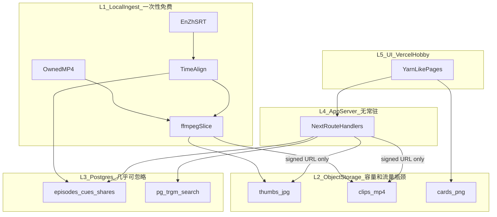
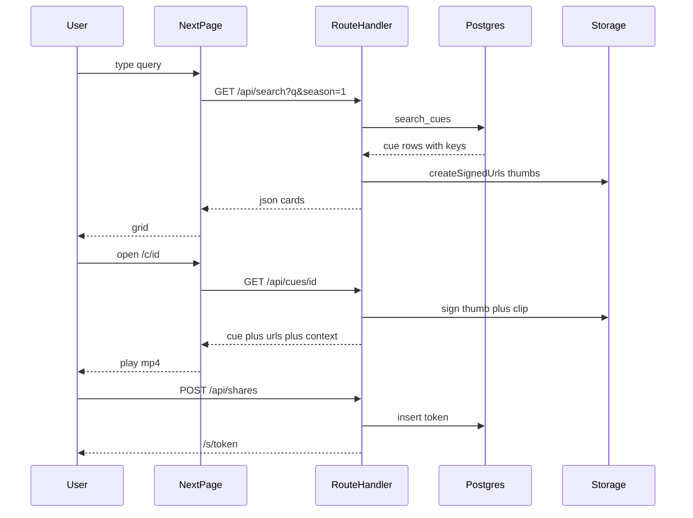

# Bigboom 实现手册（AI Coding 行动手册）

后续每一次让 Cursor 写代码，都以本手册当前 Slice 为准：先做哪一块、产出哪些模块、怎样验收。不要一次实现全剧全功能。

视觉参考：[Yarn 首页设计稿](C:\Users\17599\.cursor\projects\e-Bigboom\assets\c__Users_17599_AppData_Roaming_Cursor_User_workspaceStorage_abed62d74a1529655836289588fc4c31_images_image-c6d131f2-f0d0-4658-bec3-53c8e1c69dea.png)。学它的**信息结构**（顶栏搜索 + 封面卡片网格 + 时长角标 + 台词摘要），不复制 Yarn 商标与文案。若后续补了播放页/分享页稿，替换第 6 节对应线框即可。

---

## 0. 给 Agent 的硬约束

- 原片 MP4、原始 SRT **永不上传** Supabase，也 **不进 Git**。
- 云端只存：台词元数据、封面 JPEG、1–4 秒预览短片、分享卡片 PNG。
- 切片时长：索引短片最长 **4 秒**；分享页复用同一条短片。MVP **不做云端二次裁剪**（那会把整集原片送上云，成本爆炸）。
- 版权：私有/演示部署，分享页 `noindex`，Storage 默认私有 + 签名 URL。禁止做公网原片库。
- 成本开关：免费档只入库 **第 1 季视觉素材**；全 12 季台词表可以先建，但封面/短片用开关控制。

---

## 1. 产品 MVP 边界

**做：**
- 关键词搜中英台词（第 1 季可播，其它季若无素材则不展示卡片）
- Yarn 风格结果网格：封面、时长、剧集标签、双语台词
- 点击进入片段页：循环播放该短片、看上下文、复制分享
- 分享：双语卡片图 + 7 天过期的私有链接

**不做（第一版）：**
- 上传整集、在线精剪时间轴、GIF 工厂、用户社区、登录墙
- 悬停自动播（Yarn 有，但流量贵；MVP 改为静态封面，点击再播）
- 角色识别、弹幕、公开广场、多剧

**一次成功路径：**
输入 `bazinga` → 网格出卡片 → 点开循环播放 2 秒短片 → 复制分享链接或下载双语卡片。

---

## 2. 代价架构（分层 + 成本注释）

原则：**计算放在你的电脑上（一次性、免费），状态放在 Supabase（按量，但量要小），页面放在 Vercel（静态+轻 API）。**



### L1 采集层（本机）

- **职责：** 读本地 `data/raw/`，解析 SRT，中英时间对齐，ffmpeg 出封面和短片，调用 Service Role 上传。
- **模块：** `scripts/ingest/`（见 Slice 2）。
- **代价：** $0。CPU/磁盘是你已有的。原片可以 100GB+，因为它们不到云。
- **注释：** 这是唯一允许出现 ffmpeg 和原片路径的层。Vercel/Edge **禁止**跑切片。

### L2 对象存储（Supabase Storage）

- **职责：** 存衍生文件。bucket：`thumbs`、`clips`、`cards`，全部 **private**。
- **对象键：** `tbbt/s01/e01/{cueId}.jpg|mp4`。
- **代价（主瓶颈）：**
  - Free：1 GB 存储 + 5 GB 出站 + 5 GB 缓存出站。
  - Pro：$25/月含 100 GB 存储 + 250 GB 出站（组织订阅；Micro 计算有 $10 抵扣，单项目通常就是 $25）。
- **注释：** 一张封面按 40KB JPEG、一条 360p/2.5s 短片按 120KB 估。第 1 季约 17 集 × 280 句 ≈ 4760 条 → 封面 ~190MB + 短片 ~570MB ≈ **760MB**，卡在免费 1GB 以内。12 季全切约 7.8 万条 → **约 12GB**，必须 Pro，但仍远低于上传原片（原片可达数百 GB）。
- **省钱注释：** 不要开 Image Transformation（Free 没有，Pro 也另计费）。封面在本机压好再传。短片加 `Cache-Control: public, max-age=31536000, immutable`，命中缓存出站更便宜。

### L3 数据层（Supabase Postgres）

- **职责：** 剧集、台词、文件键、分享 token；中英检索。
- **代价：** 全剧台词 + 索引大约 **20–40MB**，Free 的 500MB 库足够。真正贵的不是库，是 L2。
- **注释：** 表里只存 Storage **路径**，不存 base64、不存原片路径（避免泄露本地盘符）。检索用 `pg_trgm`（中文）+ `english` tsvector（英文），不要上 Meilisearch（又一台服务）。

### L4 应用服务（Next.js Route Handlers）

- **职责：** 搜索、签名 URL、创建分享记录。用 `anon` 键 + RLS 读公开元数据；分享写操作用 server 端 `service role`（仅服务端环境变量）。
- **代价：** Vercel Hobby $0。无常驻、无队列。
- **注释：** API **只返回签名 URL（1 小时）**，浏览器直连 Storage，视频不走 Vercel 带宽。禁止把 Service Role 暴露到客户端。

### L5 展示层

- **职责：** Yarn 风格页面，纯读 L4。
- **代价：** $0。
- **注释：** 网格默认渲染 JPEG，不预加载 mp4，降低 L2 出站。

### 成本阶梯（按这个升级，不要提前买）

- **档 A · $0（MVP 必做）：** Supabase Free + Vercel Hobby。只上传 **S01** 封面和短片。免费项目 **7 天无访问会暂停**——演示前点一次 Dashboard 或每周打开网站。
- **档 B · $25/月：** 要全剧可播、或不能接受暂停时再升 Pro，Spend Cap 保持开启。
- **档 C · 不要走：** 原片上云、Cloudflare R2 双存储、自建 MinIO、Meilisearch。在档 B 之前都是多余操作成本。

---

## 3. 仓库与模块地图

```
E:\Bigboom\
  apps/web/                    # Next.js App Router 前端+API
  packages/db/                 # Drizzle schema，与 Supabase 共用
  scripts/ingest/              # 只在本机跑的语料流水线
  supabase/migrations/         # SQL 源
  data/raw/video/              # gitignore，你的 MP4
  data/raw/subs/               # gitignore，*.en.srt *.zh.srt
  data/work/                   # gitignore，切片临时目录，传完可删
  .cursor/rules/               # Agent 护栏
  AGENTS.md
```

运行时依赖：Node 20、pnpm、本机 ffmpeg、Supabase 项目、Vercel 账号。开发机再装 Supabase CLI 用于推 migration。

---

## 4. 语料库建设（最低成本）

### 4.1 你已有文件怎么放

约定文件名（ingest 按这个扫；若你现有命名不同，Slice 2 加一层 `manifest.csv` 映射，不要手改几千个文件）：

- `data/raw/video/TBBT_S01E01.mp4`
- `data/raw/subs/TBBT_S01E01.en.srt`
- `data/raw/subs/TBBT_S01E01.zh.srt`

一集必须成套：缺字幕或缺视频则跳过并记日志。中英 SRT 允许时间轴不完全一致。

### 4.2 流水线（本机一次性）


1. **Parse：** 标准 SRT → `{startMs,endMs,text}`。去 HTML 标签、合并同一时间轴断行。
2. **Align：** 对每条英文字幕，找时间重叠最大的中文 cue；IoU < 0.3 则 `text_zh` 为空并打标 `align_status=en_only`（反之 `zh_only`）。禁止按下标 1 对 1。
3. **Filter：** 空文本、纯音乐符号、时长 &lt; 400ms 丢弃；400ms–800ms 并入相邻句。片头片尾可用每集跳过前 20s / 后 30s 的配置。
4. **Cut（控制体积的核心）：**
   - 封面：cue 中点取帧，缩放宽 480，JPEG q=4（ffmpeg `-q:v 4`），目标 30–50KB。
   - 短片：`start-200ms` 到 `end+200ms`，**封顶 4s**；360p、30fps、H.264 `veryfast` CRF 28、AAC 64kbps；`+faststart`。
   - 先写 `data/work/`，成功上传后再删临时文件，避免磁盘堆满。
5. **Upload：** `storage.from('thumbs'|'clips').upload`，upsert。失败重试 3 次，写 `cues.media_status=failed`。
6. **Upsert：** 以 `(episode_id, start_ms, end_ms)` 幂等，支持断点续跑。

命令（Slice 2 要实现的接口）：

- `pnpm ingest --episode S01E01 --dry-run`：只对齐，打印条数和预估 MB
- `pnpm ingest --episode S01E01`：切 + 传 + 写库
- `pnpm ingest --season 1`：批量
- `pnpm ingest --season 1 --thumbs-only`：更省存储的应急档（只有封面，详情页不能播）

### 4.3 入库范围

- **现在：** dry-run 一集 → 正式 ingest `S01E01` → 确认 Dashboard 用量 → 再 `--season 1`。
- **以后：** 升 Pro 后再 `--season 2`… 流水线不变。
- 全剧 **只入库文本、不切视频** 没有产品价值（搜到了却没卡片），不要做这种半成品。

### 4.4 对应关系存在哪

一条 cue 一行。L2 文件和 L3 行靠 **同一 `cue_id`（uuid）** 绑定：

- DB：`thumb_key`、`clip_key`、时长、对齐状态
- Storage：key 与 DB 完全一致
- 应用永不拼本地路径

---

## 5. 数据模型（Supabase）

模块：`supabase/migrations/0001_init.sql` + `packages/db/schema.ts`。

- `shows`：`id`, `slug=tbbt`, `title_en`, `title_zh`
- `episodes`：`id`, `show_id`, `season`, `episode`, `title_en`, `title_zh`, `duration_ms`, `source_label`（仅文件名，不含盘符）
- `cues`：`id uuid pk`, `episode_id`, `start_ms`, `end_ms`, `text_en`, `text_zh`, `align_status`, `thumb_key`, `clip_key`, `clip_duration_ms`, `media_status`, `search_en tsvector generated`, `created_at`
- `shares`：`id`, `token unique`, `cue_id`, `expires_at`, `hit_count`
- 索引：`cues(episode_id, start_ms)`；`cues using gin (search_en)`；`cues using gin (text_zh gin_trgm_ops)`；`cues using gin (text_en gin_trgm_ops)`
- 函数 `search_cues(q text, season int default null)`：英文 `plainto_tsquery` **或** 中英 `similarity/ilike`，返回 cue+episode，limit 48
- RLS：匿名可读 `shows/episodes/cues` 中 `media_status=ready` 的行；`shares` 仅 service role 写，anon 只能读未过期 token；Storage 无 public 读，全靠签名 URL

中文检索注释：Supabase 无 zhparser。用 `pg_trgm` + `ILIKE` 对短台词足够。不要引入额外搜索引擎。

---

## 6. 前端设计（对照 Yarn 稿 + MVP 数据流）

### 6.1 路由

- `/` 首页：无关键词时展示 S01 精选/随机 24 条（对应稿中 “Find Clips…” 网格）
- `/` + `?q=` 搜索结果，同一套网格
- `/c/[cueId]` 片段详情（稿未提供，按下述线框做，可被后续设计稿替换）
- `/s/[token]` 分享落地，`noindex`

不要做 Yarn 那条「HOT / QUIZZES / MEMES」导航。MVP 顶栏只有：Logo `Bigboom`、搜索框、可选「第几季」。

### 6.2 页面 A：搜索/网格（按设计稿细化）

**布局：**
- 顶栏浅色（可用自制绿，对应稿中的绿色条，但不使用 Yarn 标识）
- 搜索框通栏，placeholder：`搜索生活大爆炸台词，中英均可`
- 其下一行筛选：季选择（默认 S01）、语言偏好（双语 / 只英 / 只中，只影响卡片上哪一行加粗）
- 主区 4 列卡片（桌面）、2 列（平板）、1 列（手机），间距与稿一致：封面 16:9，下方白底台词

**卡片内容：**
- 封面 JPEG（`thumb` 签名 URL）
- 左上叠字：`S01E03 The Fuzzy Pants Conundrum`（对应稿里封面上的片名）
- 右下深色胶囊：播放图标 + `2.1s`（对应稿里 1s–3.3s 角标）
- 封面下主台词：英文 2 行截断
- 次行：中文 1 行截断，灰色
- 无中文则只显示英文，不留空行

**交互：**
- 输入 debounce 300ms，回车立即搜；`q` 写入 URL，可分享搜索页
- 空结果：文案「没有这句台词，换个词试试」+ 热门词芯片（`bazinga`、`巴津加`、`Sheldon`）
- loading：骨架卡片，不要空白闪烁
- 点击整卡进入 `/c/[id]`；卡片上不要直接 autoplay

### 6.3 页面 B：片段详情 `/c/[id]`

- 左/上：16:9 播放器，`loop muted controls` 默认有声可点开；src 为 clip 签名 URL
- 右/下：英文字号大、中文次之、剧集、时间码
- 上下文：同一集 `start_ms` 前后各 2 句，点击可跳到对应 cue
- 主按钮：复制分享链接、下载双语卡片 PNG
- 相关：本集其它命中随机 8 条，还是同一套小卡片

### 6.4 页面 C：分享 `/s/[token]`

- 只播这一条 + 双语台词 +「去搜索更多」
- 过期显示失效页
- 无筛选、无全库入口（降低爬取面）

### 6.5 数据流转



前端状态尽量 URL 化：`q`、`season`。不要上 Redux。卡片列表用 Server Component 首屏 + 搜索时 client fetch 即可。

### 6.6 UI 技术模块

- `app/page.tsx` 首页
- `app/c/[id]/page.tsx` 详情
- `app/s/[token]/page.tsx` 分享
- `components/SearchBar.tsx`
- `components/ClipGrid.tsx` / `ClipCard.tsx`
- `components/BilingualQuote.tsx`
- `app/api/search/route.ts`
- `app/api/cues/[id]/route.ts`
- `app/api/shares/route.ts`
- `lib/supabase/{server,browser,admin}.ts`

样式：Tailwind。卡片圆角、白底、轻边框，贴近参考稿；不要渐变、不要表情图标堆砌。

---

## 7. 分步实现（每次只开一个 Slice）

### Slice 0 — 脚手架与护栏

- **模块：** Next.js 初始化、`.gitignore`、`.env.example`、`AGENTS.md`、`.cursor/rules/bigboom.mdc`
- **内容：** 写清分层（L1 本机 / L2 Storage / L3 DB）、禁止提交 `data/`、禁止客户端 Service Role、短片 ≤4s
- **验收：** `pnpm dev` 出空白首页；gitignore 生效

### Slice 1 — Supabase schema

- **模块：** `supabase/migrations/0001_init.sql`、Drizzle schema、RLS、三个 bucket
- **内容：** 扩展 `pg_trgm`；`search_cues` RPC；Storage 策略仅 service role 写
- **验收：** 本地或云端跑 migration 成功；用 SQL 插入 1 条假 cue 能 RPC 搜到

### Slice 2 — ingest CLI

- **模块：** `scripts/ingest/parseSrt.ts` `align.ts` `cut.ts` `upload.ts` `cli.ts`
- **内容：** 先 `--dry-run S01E01` 打印对齐样本，再真实切 5 条验证体积，再全集成片
- **验收：** Dashboard 中 thumbs+clips &lt; 80MB/集；抽 3 句中英能对上画面；断网重跑不重复插入

### Slice 3 — 搜索 UI

- **模块：** 第 6.2、6.6 所列页面组件和 `/api/search`
- **内容：** 严格按 Yarn 网格；双语两行；季筛选
- **验收：** 搜 `bazinga` / `巴津加` 出卡；无 autoplay；URL 可复制复现

### Slice 4 — 播放与分享

- **模块：** 详情页、`/api/cues/[id]`、`/api/shares`、卡片 PNG（可用 `satori` 或 canvas，本机也可预生成进 `cards` bucket）
- **内容：** 循环播短片、上下文、复制链接、过期 token
- **验收：** 浏览器能播；无 token 不能列目录；分享页源码含 `noindex`

### Slice 5 — 部署

- **模块：** 无新功能，按第 8 节操作
- **验收：** 生产打开搜索-播放-分享全通；Free 用量在限额内

---

## 8. 部署计划（可照做）

目标：档 A 零月费先上线 S01。操作尽量少：一个 Supabase 项目、一个 Vercel 项目、本机跑一次 ingest。

### 8.1 一次性准备

1. 安装 Node 20、pnpm、[ffmpeg](https://ffmpeg.org)（PowerShell 能跑 `ffmpeg -version`）。
2. 注册 Supabase、Vercel（GitHub 登录即可）。
3. [Supabase Dashboard](https://supabase.com/dashboard) 新建组织，套餐 **Free**。新建项目 `bigboom`，区域选离你近的（例如 `ap-southeast-1`），记下密码。
4. 项目 Settings → API：复制 `URL`、`anon`、`service_role`。Service Role 只放本机 `scripts/.env` 和 Vercel 服务端环境变量。
5. 本地 `npx supabase login` 后 `npx supabase link --project-ref <ref>`。
6. `npx supabase db push` 打上 Slice 1 的 migration。
7. Dashboard → Database → Extensions：确认 `pg_trgm` 已启用。
8. Dashboard → Storage：确认 `thumbs` `clips` `cards` 为 private。
9. 把原片按第 4.1 节放好。先只放 S01E01 三件套。

### 8.2 灌数（本机，不在 CI 里做）

1. `pnpm ingest --episode S01E01 --dry-run` 看预计条数和 MB。
2. `pnpm ingest --episode S01E01`。
3. Dashboard → Usage：Storage 应远小于 1GB；Table Editor 能看到 cue。
4. 抽查 3 个 `clip_key`，用临时签名 URL 能播。
5. 通过后再 `pnpm ingest --season 1`。若接近 1GB，停在当前集，不要强灌 S02。

### 8.3 前端上线

1. GitHub 建私有仓库（私有可降低原设计稿/文案被扫到的面；仍不要提交 `data/`）。
2. Vercel Import 该仓库，Framework Preset Next.js。
3. 环境变量（Production + Preview）：
   - `NEXT_PUBLIC_SUPABASE_URL`
   - `NEXT_PUBLIC_SUPABASE_ANON_KEY`
   - `SUPABASE_SERVICE_ROLE_KEY`（仅服务端，不要加 `NEXT_PUBLIC_`）
4. Deploy。不绑自定义域（省事，也少一层 DNS）。
5. 生产验证：搜索、播放、分享。打开 Network 确认 mp4 域名是 `*.supabase.co`，不是 Vercel。

### 8.4 日常操作（把成本留在最低）

- **再灌一集：** 本机一条 ingest 命令，不用改代码、不用重新部署。
- **看账单：** 每周打开 Supabase Usage。Free 无超限费，但会在额度满时写失败或暂停。
- **防暂停：** 免费项目 7 天无人访问会 pause。需要常在线再升 Pro，不要靠第三方“保活刷 ping”去打擦边球。
- **升全剧：** Dashboard 升 Pro、Spend Cap **开** → 本机按季 ingest。不必换架构、不必迁库。
- **不要做的运维：** 自建备份盘同步原片到云、不开第二套搜索、不把 ingest 搬进 GitHub Actions（Actions 没有你的 MP4，且工作流分钟和带宽都更贵）。

### 8.5 失败时怎么处理

- 上传到 1GB 报错：停 ingest，删 `media_status=failed` 的垃圾对象，或升 Pro。
- 网站突然打不开：先看项目是否 Paused，Unpause 即可。
- 视频 403：签名 URL 过期或 bucket 误设；回 L4 检查 `createSignedUrl`。
- 中文搜不到：确认 `pg_trgm` 和 `text_zh` GIN 索引存在。

---

## 9. Cursor 提示词模板

每开一个 Slice，对 Agent 只发下面这段并替换括号：

```
按仓库里的实现手册（.cursor/plans/tbbt_quote_clips_6799366e.plan.md）做 Slice X：
目标：（一句话）
允许改的模块：（手册列出的文件）
不要做：下一 Slice 的功能；不要上传原片；不要把 Service Role 放到客户端
验收：（手册该 Slice 的验收）
完成后用浏览器走过相关路径。
```

---

## 10. 明确不做

- 盗版片源、公网原片/切片库、可被搜索引擎收录的全集播放
- 云端 ffmpeg、原片进 Storage
- MVP 精剪时间轴、悬停自动播、多剧、App
